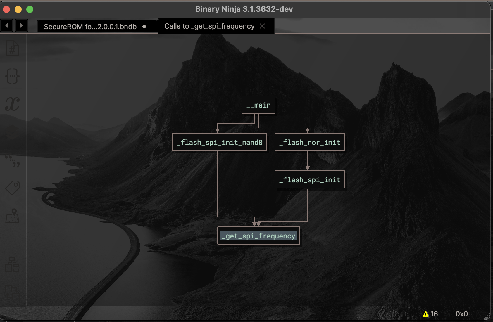

#### Yet Another Callgraph Plugin (for BinaryNinja)


### Building + Installing

```
git clone https://github.com/cxnder/yacp.git yacp
cd yacp
git submodule update --init --recursive

# if building for stable:
# cd binja && git checkout master && cd ..

mkdir build && cd build
cmake -GNinja ../
ninja all
ninja install
```

### What does it do?

#### Incoming/Outgoing Callgraphs (or both)

See the control flow leading up to this function, or the control flow of the function itself



#### Full Program Call Graphs


### How to use it?

From the Plugins menu:


From the right-click context menu:

Right click, click "Plugins" or "Selection target", click "Callgraph", see the above same options^