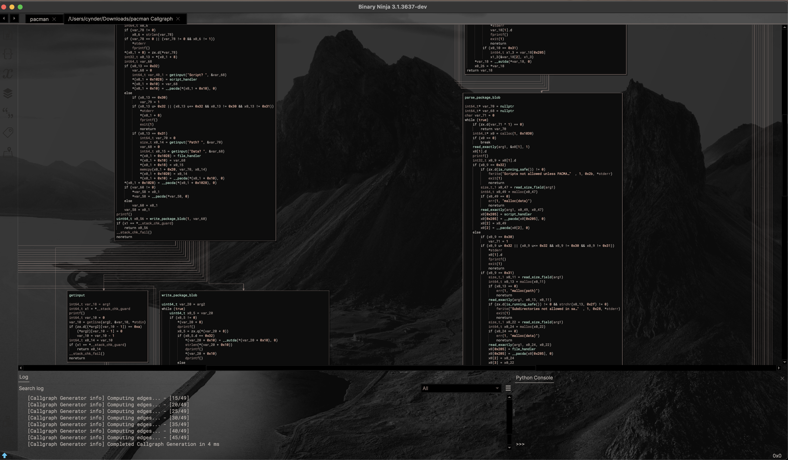

#### Yet Another Callgraph Plugin (for BinaryNinja)

* Generate Incoming/Outgoing callgraphs, with or without psuedocode
* Generate full program callgraphs in milliseconds
* Optional scope limits (only follow so many calls deep)
* Fully multithreaded, so you can continue analysis without losing any time




### Building + Installing

```
git clone https://github.com/cxnder/yacp.git yacp
cd yacp
git submodule update --init --recursive

# if building for stable:
# cd binja && git checkout master && cd ..

mkdir build && cd build
cmake -GNinja ../
ninja all
ninja install
```

### What does it do?

#### Incoming/Outgoing Callgraphs (or both)

See the control flow leading up to this function, or the control flow of the function itself


#### Full Program Call Graphs


### How to use it

From the Plugins menu:


From the right-click context menu:

Right click, click "Plugins" or "Selection target", click "Callgraph", see the above same options^

##### Callgraph Scope


The "Scope" of the callgraph is how many calls upwards or downwards from the target the graph generator will travel.

For example, with a scope of `1`, the graph will only show the target function and the functions it directly calls. 
With a scope of `2` it will process the target, the functions it calls, and the functions those functions call. 

The same applies in reverse to upwards callgraphs, and a popup will appear for both to ask what scope you would like to
generate it with.

Simply leave the dialog box empty and hit enter to not set any cap for how many levels deep to go.


###### creds

concurrency brought to you by: https://github.com/bshoshany/thread-pool